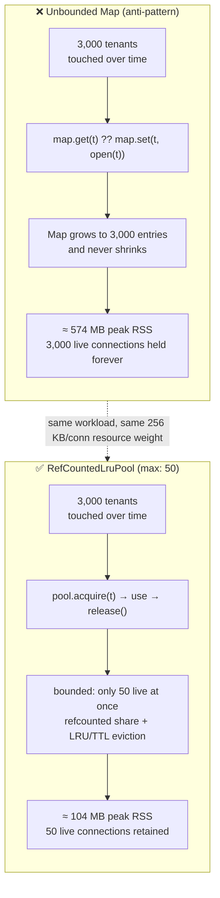
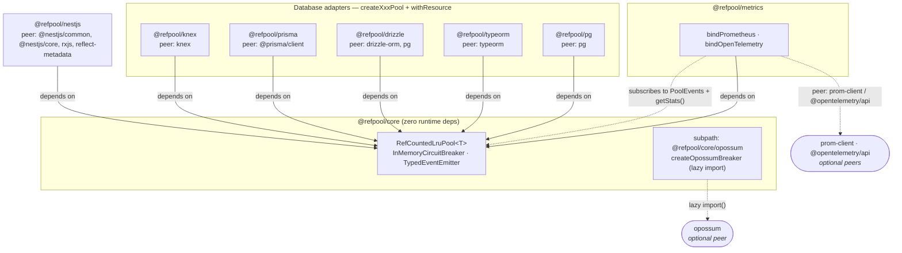
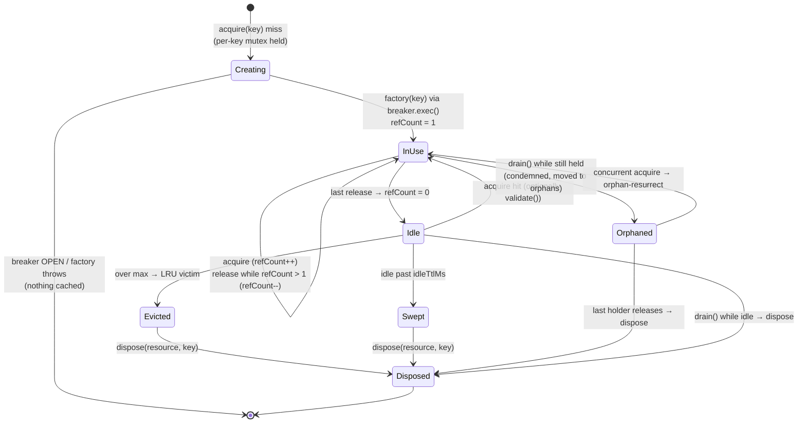
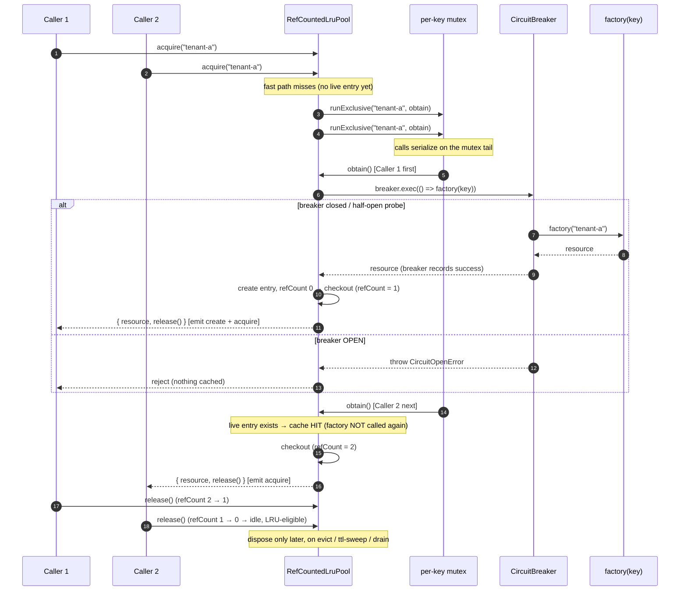
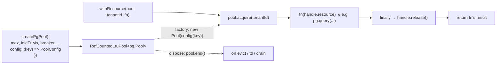
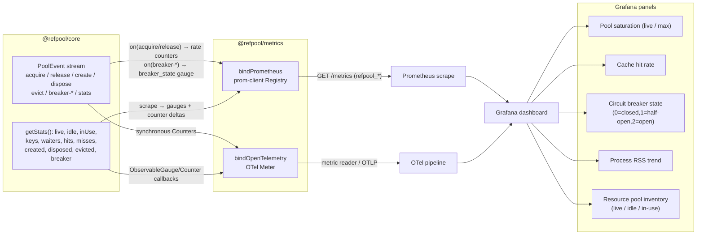

# refpool architecture

> A visual tour of how **`refpool`** is put together and how it turns the
> "one connection per tenant, forever" memory leak into a **bounded,
> reference-counted, LRU-evicting pool**.

`refpool` is a pnpm monorepo. The heart is [`@refpool/core`](packages/core): a
generic, runtime-dependency-free `RefCountedLruPool<T>`. Everything else —
metrics, database adapters, and the NestJS integration — is a thin layer that
either *subscribes to* core's events or *wraps* core's `acquire`/`release`
lifecycle for a specific resource type.

Every diagram below is [Mermaid](https://mermaid.js.org), so it renders inline
on GitHub and in most IDEs.

---

## 1. The problem refpool solves

Multi-tenant services need per-tenant isolation (different database, different
credentials, row-level isolation), so the obvious move is a `Map<tenantId,
Pool>` that lazily creates a connection pool per tenant and **never removes it**.
It demos fine, then production traffic arrives: every tenant that has *ever*
connected keeps a live pool — plus its sockets, buffers, and server-side
connections — resident forever. The `Map` only grows; RSS climbs until the
database connection limit or the host falls over. It's not a classic leak, it's
an **unbounded cache you accidentally promised to keep forever**.

`refpool` keeps the same `acquire(key)` ergonomics but caps live resources at
`max`, shares one resource across concurrent holders via reference counting, and
disposes the coldest idle resource (LRU) or idle-past-TTL resources.



The [`benchmarks/memory-soak`](benchmarks/memory-soak) harness drives an
identical 3,000-key × 4-wave workload (each "connection" owning a 256 KB buffer)
through both strategies in separate processes and samples `process.memoryUsage()`:

| Strategy | Peak RSS | Live resources retained |
| --- | --- | --- |
| Unbounded `Map` (one pool per tenant, forever) | **≈ 574 MB** | **3,000** |
| Bounded `RefCountedLruPool` (`max: 50`) | **≈ 104 MB** | **50** |
| **Improvement** | **≈ 82% lower peak RSS** | **98.3% fewer live resources** |

---

## 2. Package architecture / dependency graph

`@refpool/core` sits at the center and has **no runtime dependencies**. The
optional in-tree `opossum` breaker lives behind a subpath export
(`@refpool/core/opossum`) so importing core never hard-requires `opossum`.
Everything downstream declares `@refpool/core` as a real dependency and its
target library (`pg`, `typeorm`, NestJS, `prom-client`, …) as an **optional peer
dependency** — you only install what you actually use.



**Dependency posture at a glance:**

| Package | Runtime dep | Optional peer deps |
| --- | --- | --- |
| `@refpool/core` | *(none)* | `opossum` (only for the `/opossum` subpath) |
| `@refpool/metrics` | `@refpool/core` | `prom-client`, `@opentelemetry/api` |
| `@refpool/pg` | `@refpool/core` | `pg` |
| `@refpool/typeorm` | `@refpool/core` | `typeorm` |
| `@refpool/drizzle` | `@refpool/core` | `drizzle-orm`, `pg` |
| `@refpool/prisma` | `@refpool/core` | `@prisma/client` |
| `@refpool/knex` | `@refpool/core` | `knex` |
| `@refpool/nestjs` | `@refpool/core` | `@nestjs/common`, `@nestjs/core`, `rxjs`, `reflect-metadata` |

> Note: the node-postgres adapter's directory is `packages/node-postgres` but it
> **publishes as `@refpool/pg`**. Metrics splits its exporters across three
> subpaths: `@refpool/metrics`, `@refpool/metrics/prometheus`, and
> `@refpool/metrics/opentelemetry`.

---

## 3. Pool internals & resource lifecycle

Each key maps to at most one live `Entry<T>` holding the resource, its
`refCount`, and LRU bookkeeping. A resource is **created** on a cache miss
(guarded by a circuit breaker), becomes **in-use** while `refCount > 0`, and
becomes **idle** (reclaimable) when the last holder releases. Idle resources are
reclaimed either by **LRU eviction** (when a new key would exceed `max`) or by
the **TTL sweep** (`idleTtlMs`). On `drain()`, still-held resources are
**condemned** and parked in an *orphans* map so drain can wait for their holders
without blocking new traffic; they are disposed the instant `refCount` hits 0.



Two invariants keep this correct under churn:

- **Per-key mutex (single creation).** Cold-key acquires run through
  `runExclusive(key, …)`; N concurrent first-touches of the same key serialize so
  the `factory` runs **exactly once**. Unused mutex cells are garbage-collected on
  the `mutexGcMs` cadence. A key that has an in-flight `acquire` (`pending > 0`)
  is never chosen as an LRU/TTL victim.
- **Orphan handoff (never yanked mid-flight).** LRU/TTL only ever evict *idle*
  (`refCount === 0`) entries — an in-use resource is never disposed out from under
  a holder. The only way a held resource leaves the live map is `drain()`, which
  moves it to `orphans`, condemns it, and disposes it when its last holder
  releases.

---

## 4. `acquire` / `release` sequence (concurrent, same key)

Two callers race to `acquire('tenant-a')` on a cold key. The per-key mutex
serializes them: the first runs the factory (guarded by the circuit breaker),
the second awaits the same mutex tail and then gets a **cache hit** on the entry
the first created. Both share one resource; it only becomes idle when *both*
release, and is disposed only if it's later evicted/swept/drained.



The breaker on the create path is a state machine: **closed** (calls pass),
**open** (calls short-circuit with `CircuitOpenError` until `cooldownMs`
elapses), then **half-open** (a limited number of probes; success → closed,
failure → open). It can be a single shared breaker or one-per-key (via a breaker
factory).

---

## 5. Integration example — NestJS multi-tenant request flow

`@refpool/nestjs` wires the pool into Nest's lifecycle. `RefPoolService`
implements `OnModuleInit` (`pool.start()` + optional `warm()`) and
`OnApplicationShutdown` (`pool.stop()` → drain). `TenantConnectionMiddleware`
reads the tenant key from a header (default `x-tenant-id`), **acquires** the
per-tenant resource, attaches it to the request, and registers a **release** on
response `finish`/`close` — so the holder's reference is always dropped when the
request ends. `ConnectionHealthController` exposes live stats at
`GET /health/connections`.

```mermaid
sequenceDiagram
    autonumber
    participant App as Nest app
    participant Svc as RefPoolService
    participant Pool as RefCountedLruPool
    participant MW as TenantConnectionMiddleware
    participant Ctl as Controller
    participant Res as HTTP response

    rect rgb(235, 244, 255)
    Note over App,Pool: module lifecycle
    App->>Svc: onModuleInit()
    Svc->>Pool: start() (+ warm() if configured)
    end

    rect rgb(238, 250, 238)
    Note over MW,Res: per request
    App->>MW: use(req, res, next) — read x-tenant-id
    alt header present
        MW->>Svc: acquire(tenantId)
        Svc->>Pool: acquire(tenantId)
        Pool-->>MW: { resource, release }
        MW->>Res: res.on("finish"/"close", release)
        MW->>Ctl: req.tenantResource = resource; next()
        Ctl->>Ctl: use req.tenantResource (e.g. pool.query)
        Ctl-->>Res: send response
        Res-->>Pool: finish/close → release() (refCount--)
    else header missing (onMissing)
        MW->>Ctl: next() or next(error)
    end
    end

    Note over App,Pool: GET /health/connections → RefPoolService.getStats()

    rect rgb(255, 244, 235)
    Note over App,Pool: shutdown
    App->>Svc: onApplicationShutdown()
    Svc->>Pool: stop() → drain (condemn held, dispose idle)
    end
```

> The example app in [`examples/nest-multitenant`](examples/nest-multitenant)
> wires this with `RefPoolModule.forRootAsync<Pool>({ … })` and applies the
> middleware to the tenant routes. Controllers can either use the
> already-acquired `req.tenantResource`, or acquire explicitly via the adapter's
> `withResource` helper (see §6).

---

## 6. Integration example — adapter usage

Every database adapter follows the same two-function shape: a
`createXxxPool({ config | client, ...poolOptions })` factory that returns a
`RefCountedLruPool<Resource>`, and a `withResource(pool, key, fn)` helper that
does **acquire → run → release** with the release in a `finally`. All the core
`PoolOptions` (`max`, `idleTtlMs`, `breaker`, `prewarm`, `validate`, …) pass
straight through.



The resource type and its create/dispose calls are the only things that differ
per adapter:

| Adapter | Pooled resource | `factory` builds | `dispose` calls |
| --- | --- | --- | --- |
| `@refpool/pg` | `pg.Pool` | `new Pool(config(key))` | `pool.end()` |
| `@refpool/typeorm` | `DataSource` | `new DataSource(config(key)).initialize()` | `dataSource.destroy()` |
| `@refpool/drizzle` | `NodePgDatabase` | `drizzle(new Pool(config(key)))` | underlying `pool.end()` |
| `@refpool/prisma` | `PrismaClient` | `client(key).$connect()` | `client.$disconnect()` |
| `@refpool/knex` | `Knex` | `knex(config(key))` | `knex.destroy()` |

```ts
import { createPgPool, withResource } from '@refpool/pg';

const pool = createPgPool({
  max: 25,
  idleTtlMs: 30_000,
  config: (tenantId) => ({ connectionString: urlFor(tenantId) }),
});
pool.start();

const { rows } = await withResource(pool, tenantId, (pg) => pg.query('select now()'));
```

---

## 7. Observability wiring

Core is the single source of truth: it emits typed `PoolEvent`s (`acquire`,
`release`, `create`, `dispose`, `evict`, `breaker-*`, `idle-sweep`, `stats`, …)
and exposes a `getStats()` snapshot. `@refpool/metrics` binds to that surface —
`bindPrometheus(pool, { max })` and `bindOpenTelemetry(pool, { meter, max })` —
translating it into `refpool_*` metrics. Stats-derived gauges/counters are
sampled from `getStats()` on each scrape; acquire/release rates and the live
breaker-state gauge are driven by events. `saturation = live / max` (you pass
`max` because core doesn't expose it publicly). A ready-to-import dashboard
lives at [`grafana/refpool-dashboard.json`](grafana/refpool-dashboard.json).



Exported `refpool_*` instruments include: `refpool_live`, `refpool_idle`,
`refpool_in_use`, `refpool_keys`, `refpool_waiters`, `refpool_max`,
`refpool_saturation_ratio`, `refpool_breaker_state`, and the cumulative counters
`refpool_created_total`, `refpool_disposed_total`, `refpool_evicted_total`,
`refpool_hits_total`, `refpool_misses_total`, `refpool_acquires_total`,
`refpool_releases_total`, and `refpool_breaker_transitions_total`.

---

## Appendix — the core public API

```ts
class RefCountedLruPool<T> {
  constructor(options: PoolOptions<T>);

  acquire(key: string): Promise<AcquireHandle<T>>; // { resource, release() }
  release(key: string): void;                      // convenience: drop one ref by key
  warm(strategy?: PrewarmStrategy<T>): Promise<void>;
  start(): void;                                   // arm ttl-sweep / mutex-gc / stats timers
  stop(): Promise<void>;                           // stop timers + drain
  drain(): Promise<void>;                          // condemn held, dispose idle
  getStats(): PoolStats;
  on(type, listener): () => void;                  // typed PoolEvent subscription
  off(type, listener): void;
}
```

`PoolOptions<T>` key fields: `factory(key)`, `dispose(resource, key)`, `max`,
`idleTtlMs`, `mutexGcMs`, `statsIntervalMs`, `breaker` (a shared
`CircuitBreaker` or a per-key factory), `prewarm`, `validate`, and `logger`.
