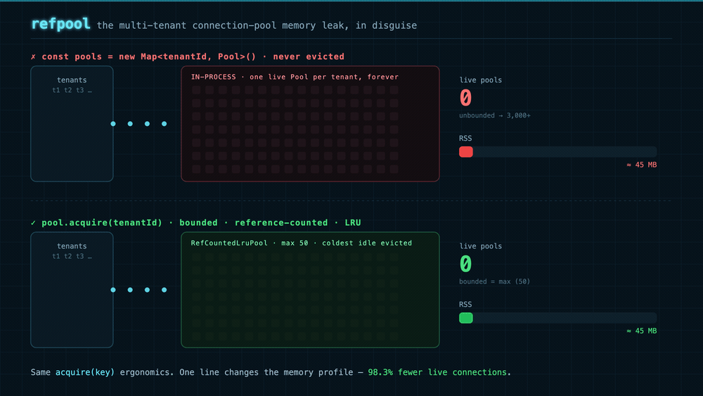
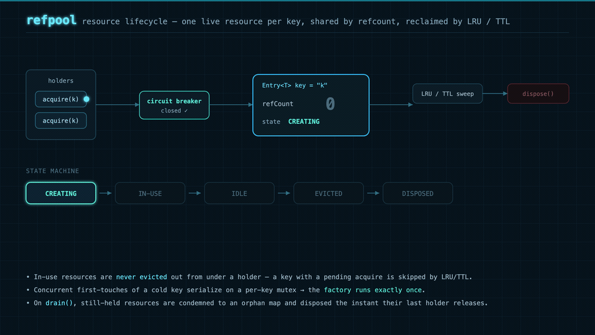
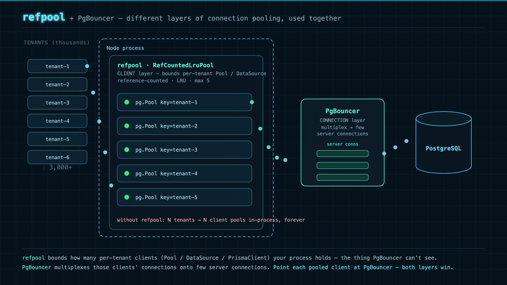

# refpool

> A keyed, **reference-counted, bounded LRU resource pool** for Node.js — and the
> adapters that make it a drop-in fix for multi-tenant database connection sprawl.

This README is written to my past self: the version of me who, building a
multi-tenant service, reached for the obvious thing and got burned by it. If
that's you right now, read on.



---

## The problem (a memory leak in disguise)

You're multi-tenant. Each tenant needs its own database connection (different
database, different credentials, row-level isolation — pick your reason). So you
do the obvious thing:

```ts
const pools = new Map<string, Pool>();

function getPool(tenantId: string) {
  let pool = pools.get(tenantId);
  if (!pool) {
    pool = new Pool(configFor(tenantId)); // one pool per tenant
    pools.set(tenantId, pool);
  }
  return pool;
}
```

It works in the demo. Then traffic arrives. Tenant #1 through #3,000 each get a
live connection pool, and **nothing ever removes them**. The `Map` only grows.
Every tenant who has *ever* connected keeps a live pool — and its sockets,
buffers, and server-side connections — alive forever. RSS climbs, the database's
connection limit gets hit, and eventually something falls over. It's not a leak
in the classic sense; it's an *unbounded cache* that you accidentally promised
to keep forever.

The naive fixes are all bad: tear down the pool after every request (you lose all
the benefit of pooling), or guess a TTL and pray (races: you dispose a pool a
request is mid-flight on).

## The solution

What you actually want is a **bounded, reference-counted pool keyed by tenant**:

- **Bounded** — `max` is a *hard ceiling*: never more than `max` live resources.
  A new key evicts the coldest *idle* one (LRU) to make room, and when every live
  resource is in use, `acquire` applies backpressure — it *blocks* for a slot (up
  to `acquireTimeoutMs`) instead of over-provisioning.
- **Reference-counted** — concurrent requests for the same tenant share one
  resource; it only becomes reclaimable when the *last* holder releases. No
  request ever has its connection pulled out from under it.
- **Self-reclaiming** — idle resources past a TTL are swept and disposed.
- **Safe under churn** — a per-key mutex means N concurrent first-touches of a
  cold key create exactly one resource; an "orphan handoff" keeps an
  in-use-but-evicted resource alive until its holders are done, then disposes it.

That's `refpool`. The core is **generic** — it pools *any* expensive keyed
resource — and the database story is the flagship application built on top of it.

### How it works

A single live resource per key, shared by reference count, reclaimed by LRU / TTL —
in-use resources are never pulled out from under a holder:



## refpool & PgBouncer (multi-tenancy)

"Doesn't PgBouncer already do connection pooling?" — it does, at a *different layer*.
**PgBouncer** multiplexes many client connections onto a few **server** connections,
for one database. **refpool** bounds how many per-tenant **clients** (`pg.Pool` /
`DataSource` / `PrismaClient`) your Node process holds — the in-process sprawl
PgBouncer can't see. They're complementary: point each pooled client *at* PgBouncer
and both layers win.



## Quick start (the generic core)

```bash
npm install @refpool/core
```

```ts
import { RefCountedLruPool } from '@refpool/core';

const pool = new RefCountedLruPool<MyClient>({
  max: 50,                            // hard ceiling on live resources
  factory: async (key) => createClient(key),
  dispose: async (client) => client.close(),
  idleTtlMs: 30_000,                  // reclaim idle resources after 30s
});
pool.start();

const { resource, release } = await pool.acquire('tenant-a');
try {
  await resource.doWork();
} finally {
  release();                          // idempotent; drops just this holder's ref
}

await pool.stop();                    // drains + disposes everything
```

Prefer not to manage handles by hand? Every DB adapter ships a `withResource`
helper that acquires, runs, and releases in a `finally`:

```ts
import { createPgPool, withResource } from '@refpool/pg';

const pool = createPgPool({ max: 25, config: (t) => ({ connectionString: urlFor(t) }) });
const { rows } = await withResource(pool, tenantId, (pg) => pg.query('select now()'));
```

## Does it actually help? (benchmarks)

**Memory** — [`benchmarks/memory-soak`](benchmarks/memory-soak) runs the
**unbounded `Map` anti-pattern** against a bounded `RefCountedLruPool` over 3,000
distinct tenant keys (each "connection" owning a 256 KB buffer), recording RSS
over time.

| Strategy | Live resources retained | Peak RSS |
| --- | --- | --- |
| Unbounded `Map` (one pool per tenant, forever) | **3,000** | ~600–670 MB |
| Bounded `RefCountedLruPool` (`max: 50`) | **50** | ~105–140 MB |
| **Improvement** | **98.3% fewer live resources** | **~80% lower (4–5×)** |

The live-resource reduction is exact and deterministic (`3,000 → 50`); peak RSS
is machine-dependent, so it's quoted as a range — expect ~80% / 4–5× lower.

**CPU / scale** — [`benchmarks/eviction-throughput`](benchmarks/eviction-throughput)
proves the bounding stays *cheap*: it pits refpool's O(1) intrusive idle-list
eviction against a naive full-scan LRU across a geometrically growing `max`.
refpool's per-op cost stays roughly flat while the naive scan degrades linearly —
the speedup grows from ~1× at `max=64` to **100×+** by tens of thousands of live
keys.

Both are reproducible: `pnpm --filter @refpool/benchmark-memory-soak bench` and
`pnpm --filter @refpool/benchmark-eviction-throughput bench`.

## Packages

| Package | Purpose |
| --- | --- |
| [`@refpool/core`](packages/core) | The pool itself: `RefCountedLruPool`, circuit breakers, typed events. Runtime-dependency-free. |
| [`@refpool/metrics`](packages/metrics) | Prometheus + OpenTelemetry exporters (`refpool_*` metrics) and a Grafana dashboard. |
| [`@refpool/pg`](packages/node-postgres) | node-postgres (`pg`) `Pool` adapter. |
| [`@refpool/typeorm`](packages/typeorm) | TypeORM `DataSource` adapter. |
| [`@refpool/drizzle`](packages/drizzle) | Drizzle (node-postgres) database adapter. |
| [`@refpool/prisma`](packages/prisma) | `PrismaClient` adapter. |
| [`@refpool/knex`](packages/knex) | Knex instance adapter. |
| [`@refpool/nestjs`](packages/nestjs) | NestJS module, service, tenant middleware, and `/health/connections` route. |

Every adapter exposes `createXxxPool({ config | client, ...poolOptions })` plus a
`withResource(pool, key, fn)` helper, and forwards all
[`PoolOptions`](packages/core#pooloptionst) (`max`, `idleTtlMs`, `breaker`,
`prewarm`, …) to the core pool.

## Observability

`refpool` is built to be watched in production:

- The core pool emits typed events (`acquire`, `release`, `evict`, `breaker-*`,
  `stats`, …) and a `getStats()` snapshot (`live`, `idle`, `inUse`, `waiters`,
  `hits`, `misses`, breaker transitions).
- [`@refpool/metrics`](packages/metrics) turns those into `refpool_*` Prometheus
  or OpenTelemetry metrics — saturation (`live / max`), hit rate, in-flight
  waiters, and live circuit-breaker state — with one line of wiring.
- A ready-to-import Grafana dashboard lives at
  [`grafana/refpool-dashboard.json`](grafana/refpool-dashboard.json).

## Resilience

Resource creation can be guarded by a **circuit breaker** (shared or per-key) so
a flapping tenant database doesn't stampede your service: a dependency-free
`InMemoryCircuitBreaker` ships in core, and `@refpool/core/opossum` adapts the
optional [`opossum`](https://github.com/nodeshift/opossum) breaker.

## Examples

- [`examples/nest-multitenant`](examples/nest-multitenant) — a runnable NestJS app
  pooling one Postgres pool per tenant, keyed off the `x-tenant-id` header.
- [`examples/generic-http-clients`](examples/generic-http-clients) — a non-DB demo
  (pooling keep-alive HTTP clients) proving the generic positioning.

## Repo layout

```
packages/      publishable @refpool/* packages
examples/      runnable demos (not published)
benchmarks/    memory-soak + eviction-throughput benchmarks (not published)
grafana/       importable dashboard JSON
```

This is a pnpm + changesets monorepo. `pnpm build` builds every package,
`pnpm test` runs the suite, and releases are versioned with changesets.

## Author

Built by **Atul Singh** — [atulsingh.io](https://atulsingh.io) ·
[github.com/expedite-atul](https://github.com/expedite-atul).
Issues and PRs welcome at [expedite-atul/refpool](https://github.com/expedite-atul/refpool).

## License

MIT © Atul Singh
